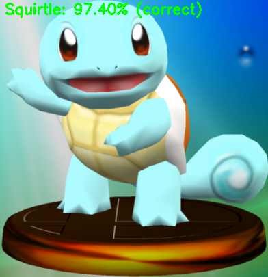
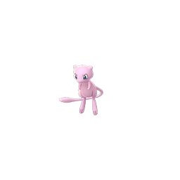
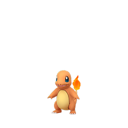
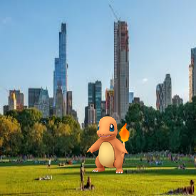

# Pokemon with CNNs

This project currently has two decent neural network models.
 - A smaller version of VGG Net from this tutorial: https://www.pyimagesearch.com/2018/04/16/keras-and-convolutional-neural-networks-cnns/
 - Resnet 34: https://github.com/raghakot/keras-resnet
 
Ex: 
```
./classify.py -m poke_small_vgg.model -l pokemon.pickle -i squirtle.png
[INFO] classifying image...
Machop: 0.70%
Seadra: 0.82%
Squirtle: 97.40%
```



## Preparing Data

Data is stored in a folder with each subfolder representing a class. Ex:

```
dataset/
├── Charmander/
│   ├── img1.png
│   ├── img2.png
│   ├── img3.jpg
│   └── ...
├── Squritle/
│   ├── img1.png
│   ├── img2.png
│   ├── img3.jpg
│   └── ...
└── Bulbasaur/
    ├── img1.png
    ├── img2.png
    ├── img3.jpg
    └── ...
```

An existing dataset is provided, albeit weak. 

```
unzip dataset.zip
```

The dataset can be strengthened by putting the images of pokemon in front of random backgrounds with random transformations


The following script will scrape the dataset directory and create new images for each image in each class from the `dataset` folder and place them in `dataset_augmented`

```
./add_background.py
```

The results will look like this: 

 

 


## Training

```
./train.py -m <output model file> -l <output label file> -d <dataset folder> -t [vggnet | resnet]
```

## Clasification using Trained Model

```
./classify.py -m <saved model file> -l <saved label file> -i <path to image file to classify>
```
